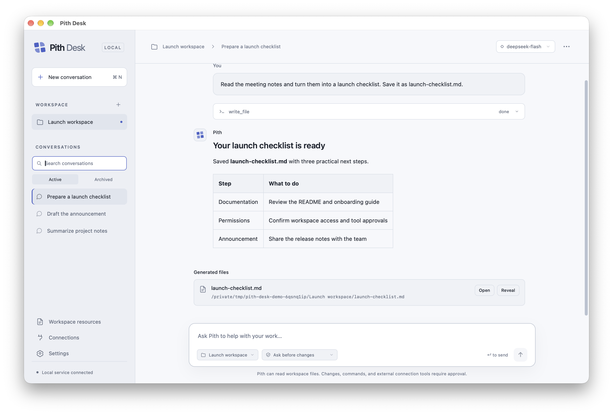

# Pith Desk

A local desktop workspace for getting things done with an AI agent. Pith Desk uses [Pith](https://github.com/minifish-org/pith) as a versioned Go library and [MyGo](https://github.com/egoist/mygo) for the native window. The interface is TypeScript. The product is a separate repository; agent behavior stays in the Pith SDK.

This preview supports text and image conversations, workspace folders, streamed answers, guarded tools, instructions/skills/prompt templates, conversation branches, manual compression, deferred MCP discovery, Code mode, OAuth, durable task journals and request cost estimates. DeepSeek Flash is the default model. See [SDK integration](docs/SDK_FEATURES.md) for the reused capabilities and their boundaries. Provider selection, model capabilities, thinking levels and native request adapters come from Pith’s SDK. API-key connections include DeepSeek, OpenAI, Anthropic, Google, Mistral and compatible providers in its catalog.



*The macOS desktop in Light appearance, using a demonstration workspace and conversation.*

## Try it

Download the Apple Silicon (ARM64) preview from [Releases](https://github.com/minifish-org/pith-desk/releases). New Mac releases target M-series Macs only; packages use `macos-arm64` in their names. The earlier `v0.1.0-rc.1` universal preview remains available unchanged. The current preview is ad-hoc signed and **not notarized**; see the release notes for macOS opening instructions and tested platforms. Building from source remains an option for development.

The preview includes the Pith Desk icon in Finder and the Dock, with a matching
favicon for the browser preview.

On macOS, open the built **Pith Desk.app**. You do not need Go, Node.js or npm to run the packaged application.

1. Choose a workspace folder.
2. Open Settings, choose a provider and enter its API key, or use **Sign in with provider** when Pith offers OAuth. The default endpoint is filled in automatically; **Advanced connection settings** lets you override it. Use **Test connection** to check streaming and tool calling using that provider’s last selected model or Pith’s default, then Save settings. Testing sends one small model request, does not save the form, and never accesses workspace files or executes tools.
3. Choose a model and thinking effort beside the message box. Create a conversation and ask the agent to inspect or change files in that folder.
4. Review the tool name and arguments before approving a file change or command. You can change the permission mode beside the message box. Use Stop to cancel a running task.

For a safe first task, choose an empty test folder and ask: “Create a short welcome.md that explains what you can do in this workspace.”

The application saves settings and conversation data in your user configuration directory (`~/Library/Application Support/Pith Desk` on macOS). The key is stored in a private local file, not in the frontend, URLs or the repository. This version does not use macOS Keychain.

### Providers, models and thinking effort

**Settings** manages independent model connections. Choose a built-in provider and save its key or sign in through its SDK OAuth flow. **Add independent model connection** gives another endpoint its own name, protocol, models and credentials. Official OpenAI and several OpenAI-compatible endpoints can coexist. API base URL is prefilled and hidden under
**Advanced connection settings** for proxies and custom services. Saving another
provider’s connection does not change the active conversation model. Pith supplies the catalog, input
capabilities, context/output limits, and supported thinking levels. The model
list is the catalog bundled with the pinned Pith SDK, **not** a live list of
models authorized for your account. Updating the SDK updates this catalog.
The endpoint override must speak the selected model's native protocol.

The model button beside the composer opens a searchable
picker for configured providers. The thinking selector only shows levels that
Pith says the selected model supports, including `max` when available. Models
with no reasoning support hide that control. Changes apply to the next task;
stop a running task before changing its model or effort. The run details record
the provider and effort actually selected for that task.

Each provider retains its own endpoint, key and last selection. Switching
providers restores those settings. Changing an endpoint requires entering the
key again: a saved credential is never silently forwarded to a new address.
Custom connections have their own model IDs, capabilities, limits and optional
USD prices. Blank prices mean unknown; explicit zero prices mean free. A blank
key on a custom connection sends the SDK adapters a non-secret `unused` key,
which is suitable only for servers that ignore authentication.

Agent requests, connection probes and context summaries all use Pith's native
adapters. Desk does not implement separate OpenAI, Anthropic or Google clients.
OAuth availability comes from the selected SDK provider. The sign-in dialog
opens the provider page and forwards device codes or additional prompts; tokens
are saved by Pith and refreshed for subsequent requests. OAuth uses the official
provider endpoint, not a custom proxy. Cloud credential setups such as Bedrock,
Vertex and Azure are not configured by this UI.

### Appearance

Open **Settings → Appearance** to choose **Light**, **Dark**, or **Follow system**. Light uses a porcelain background with an indigo accent; Dark uses graphite with an ice-blue accent. Follow system is the default and responds to changes in your operating system's appearance while the app is open. Manual choices override the system until you select Follow system again.

Appearance changes apply immediately, including during an agent task, and are saved in the local settings file for the next launch. Native window controls follow the same preference. Model settings and conversation permissions are independent of appearance.

### Conversation permissions

Each new conversation starts with **Ask before changes**. Reads and searches can run without a prompt; file changes and commands need a decision.

- **Allow workspace changes** lets file tools create and edit files inside the selected workspace without asking each time. Commands still need approval. A file-change approval card also offers **Always allow workspace changes** for that conversation.
- **Full access** also lets commands and enabled MCP tools run without individual approval. Choosing this mode requires explicit confirmation because commands and external tools can access data beyond the workspace. There is no operating-system sandbox.

The choice is saved for that conversation and survives restarting the app. It does not apply to other conversations. Change back to **Ask before changes** to require approval for future changes; revoking permission does not undo an action already executing.

### Continue a running task

While Pith is working, sending a message queues it for when the current task would otherwise finish. In **Pending messages**, edit or delete individual messages, or click **Steer** to turn one into an **Instruction** for the next turn boundary. Steering waits for the current model response and tool batch; it does not interrupt a running command. Editing preserves attached images. Messages already received by the agent cannot be edited or deleted. Stop cancels the task and clears its pending messages; they are not carried into a later task or another conversation.

### Run status and recovery

Expand the status line above the composer to see the running model, Pith session token usage, estimated conversation context, context summary count, recorded tool failures and estimated cost. Expand **Request breakdown** within those statistics for each reported request, including retries and context summaries, with input/output/cache tokens, purpose, status, saved rates and price source. Model retries and context summarization have their own status. Conversation context excludes system instructions and tool schemas. Costs are USD estimates from the bundled Pith/Pi catalog or custom prices, not the provider bill. Requests with unknown usage or prices are excluded from totals. No external pricing or exchange-rate API is called. Earlier requests made before the ledger was added are not reconstructed.

The same status line shows the latest task's total elapsed time and average output tokens per second. Time includes tools, approval waits, retries and context summaries; speed uses that task's reported output tokens (including reasoning), excluding input, cache and earlier tasks. It is a task average, not instantaneous model decoding speed. Completed and stopped timing survives reopening. Old runs without timing show **Not recorded**; interrupted checkpoints show a lower-bound duration and no speed, excluding app downtime.

Failures show guidance for credentials, unknown models, incompatible endpoints, network interruptions, rate limits, summarization and local errors. **Review and continue** sends an explicit new instruction using the existing Pith transcript. It does not replay the original task or automatically restart actions after a crash. Review already completed or uncertain external actions first. After changing model settings, test the connection before continuing.

Run metadata is saved beside the sessions. After an interrupted shutdown, the conversation is marked for review when reopened. Settings and failure cards offer **Save diagnostics** through a native save dialog. The JSON contains version/platform information, counts, usage and failure category; it excludes prompts, transcript text, file contents, local paths, endpoint URLs, tool arguments and credentials.

### Conversations and files

The sidebar groups conversations under their workspace folders. Expand or collapse a folder, or use its new-conversation button to start a chat in that workspace. Search conversation titles across workspaces. Each conversation's `…` menu can rename, export or permanently delete that conversation without opening it first. Desktop exports open a native save dialog so you can choose the destination. Titles are recorded through Pith's session API; the desktop catalog indexes them.

**Delete conversation** permanently removes its local session history, image attachments and run receipt. **Remove workspace**, in the folder's `…` menu, unlinks the folder and deletes all its conversations and related application data. Both require confirmation and are blocked while a task is running. Workspace folders and their files—including files created by Pith and exported documents—are never deleted. There is no archive or restore feature. Removing a folder leaves no dangling conversations.

Deletion intent is saved before the catalog changes. If cleanup is interrupted, Pith Desk retries committed deletions on startup; uncommitted requests leave their conversation data intact. Cleanup errors are reported and never treated as a successful deletion.

Press `⌘N` (`Ctrl+N` on Linux) to start a conversation in the current workspace.

After a task finishes, successful file writes and edits appear as generated-file cards. **Open** uses the default application; **Reveal** shows the file in your file manager. Missing files, failed changes, and files outside the workspace are excluded. Files created by arbitrary shell commands are not automatically detected. Browser preview shows paths but native file actions require the desktop app.

### Workspace instructions, skills and prompt templates

Open **Workspace resources** to inspect the files discovered by Pith. Instructions
include AGENTS.md and CLAUDE.md along the ancestor path; project skills live in
`.pi/skills`, and prompt templates in `.pi/prompts`. View, create, edit or delete
project resources in the Markdown editor. Inherited instructions are read-only
here. Changes load on the next task. **Use** inserts `/skill:name` or `/name` into
the composer; Pith expands the resource and template arguments when submitted.

The application retains Pith's instruction and skill discovery. Skill references to the `read` tool are mapped in the desktop prompt to its guarded `read_file` tool. No separate skill engine or visual workflow builder is used.

### MCP connections

Open **Connections** to configure an HTTP endpoint or an installed local MCP server command. HTTP connections accept an optional bearer token; an empty token field preserves the saved token. Local commands accept an argument array and optional environment overrides as a JSON object of string values. Blank overrides preserve saved values; use the clear checkbox to remove them. Only saved variable names are displayed. Enable only the connections you want available, then connect explicitly or let the next task connect them. Connection status and tool counts appear in the dialog.

Pith provides the MCP transports, discovery, OAuth and calls. Desk saves connection settings, supplies sign-in UI and applies approvals. Enabled MCP tools are registered as deferred: the model starts with `tool_search`, and selected schemas become available on demand. Connecting still discovers the server catalog; deferred exposure saves model context rather than avoiding that initial catalog request. **Ask before changes** and **Allow workspace changes** both require approval for external MCP calls. **Full access** also authorizes tools from enabled connections. Connection changes and disconnects require the current task to finish or stop first.

Tokens and environment overrides are saved in the private local `mcp.json` file and their values are never returned in public configuration responses. This client does not install MCP servers or bundle their Node/Python runtimes. HTTP MCP connections can use the SDK OAuth flow instead of a bearer token, with optional client ID and scope. Sign in, then connect or reconnect to load tools. The temporary callback uses `127.0.0.1:54819`; the port must be available. External servers decide whether they support discovery and dynamic client registration. A connector marketplace is outside this version's scope.

### Code mode, history and recovery

**Code mode** is enabled alongside ordinary tools. The agent chooses whether to
compose several tool calls, filter results or return a smaller answer through
Pith's existing JavaScript/WASM runtime. Nested writes, commands and MCP calls
use the same workspace checks and approval rules as direct calls. Code mode
does not install Node.js and is not an OS sandbox for the tools it invokes.

Use the branch action below a saved assistant reply to continue from that point,
or **Conversation branches** in the conversation's sidebar menu to choose a
saved node. Pith preserves sibling branches in the same session; this does not
undo files, commands or remote effects. **Compact** calls Pith's summarizer,
keeps recent messages and preserves saved history. Short conversations may have
nothing to compress. Compression is a model request and appears in the cost ledger.

Every task is admitted to a Pith Durable JSONL journal before it runs, alongside
pending queued text/images. Restart shows an interrupted task for review; **Continue**
starts a new task over saved history and restores pending queue items. Unfinished
commands or remote effects are never automatically replayed. This is durable
admission, settlement and queue recovery around the coding-agent session, not an
exactly-once guarantee for each external effect or a resumable model stream.
Deleting a conversation also deletes its local cost ledger and durable journal.

## Images

Use **Attach images** in the composer, drag images onto it, or paste a screenshot.
Preview and remove attachments before sending. An image can be sent alone, with
text, or as a queued instruction or next task while the agent is working.

PNG, JPEG, GIF and WebP are accepted, with a **20 MiB total upload limit per
message** to bound local upload memory. Provider limits may be lower. Image
bytes are sent unchanged; this client does not resize or transcode uploads.
Model capability comes from the pinned Pith catalog. Text-only models reject
image inputs before starting a run; a compatible endpoint must actually support
the selected model's image input.

Accepted images are saved inside Pith's local session records, outside the
workspace, and sent to your configured model provider. Unsaved drafts stay in
memory and are cleared when you start or switch conversations. History previews
are fetched from the authenticated local service; image bytes are not included
in every streaming state update. Guarded workspace image reading is also enabled
for image-capable models. Markdown exports mark image attachments but do not
embed their bytes.

Download the
[`v0.1.0-rc.8` Apple Silicon preview](https://github.com/minifish-org/pith-desk/releases/tag/v0.1.0-rc.8).


## Develop

Requirements: Go 1.27.1 or later, Node.js 22.12 or later, npm, and macOS 12 or later for the first desktop target.

```sh
npm ci
npm --prefix frontend ci
npm run dev
```

`dev` builds the frontend and starts the native desktop window with CGO disabled. The same UI can be inspected in a browser:

```sh
npm run preview
```

Open the loopback URL printed by the process. The browser preview uses the real local backend and the same local data. Its workspace picker accepts a path; the native application also has a folder dialog. Only one process may open a data directory at a time. Close the native application before previewing, or run `CGO_ENABLED=0 go run ./cmd/pith-desk --preview --data-dir /path/to/separate/test-data` after building the frontend. This is a local development preview, not a server deployment mode.

## Build a Mac application

```sh
npm run build
```

The local build creates an application bundle under `build/`. It uses ad-hoc signing and skips notarization and DMG generation. Developer ID signing and notarization are separate release steps for distributing outside this machine. `npm run build` uses the current host architecture; `npm run build:mac` and Mac release packaging target Apple Silicon (ARM64). Source builds on Intel Mac are outside the supported scope.

```sh
npm --prefix frontend run build
CGO_ENABLED=0 go test ./...
CGO_ENABLED=0 go vet ./...
```

Both Pith and MyGo are pinned in `go.mod`; applications build without a sibling checkout or a local Go replacement. Release checks use `GOWORK=off` to verify the versioned dependency. See [SDK dependency validation](docs/SDK_FEATURES.md#versioned-sdk-dependency). Node/npm are development tools only. The Mac window uses the system WKWebView, which may have its own helper processes.

## Where to read the code

- `frontend/src/`: layout, settings, conversations, streamed state and approval controls.
- `internal/desk/`: the application service and its Pith SDK adapter, persisted settings/history and tool policy.
- `internal/host/`: embedded frontend, authenticated loopback API and streamed snapshots.
- `cmd/pith-desk/`: the native window, folder picker, application lifetime and browser preview.
- `mygo.config.ts`: build and packaging settings.

The Go service owns each agent run. Closing a browser subscription does not end a run. **Stop** aborts it explicitly; application shutdown preserves an unfinished durable task for user-reviewed recovery. The frontend only renders snapshots and submits user actions.

See [testing and native smoke checks](docs/TESTING.md) for verification and a short manual checklist.

## Current boundaries

This is an experimental local desktop product. It has no computer-control tools, plugin marketplace, scheduled jobs, enterprise account system or automatic updates yet. Recovery requires user review and cannot roll back or deduplicate external effects.

Workspace checks are an application tool policy, **not an operating-system sandbox**. File tools reject paths outside the workspace. An approved command can access the computer with your account's permissions; examine it before allowing it. Model requests send the conversation and tool results to your configured provider. See [security and data handling](docs/SECURITY.md).

Pith Desk targets macOS on Apple Silicon (ARM64) and Linux. Intel Mac and Windows are not supported. Native application testing and the current CI workflow cover Mac ARM64; Linux runtime testing and public release packages are still pending. For end users, downloadable application packages are the intended delivery path; building from source is a development option. Preview downloads use manual replacement of the app bundle; no automatic updater is available. See [release packaging and signing](docs/RELEASING.md).

CGO-disabled cross-builds have passed for Linux on amd64 and arm64. This establishes compilation only. Linux needs GTK3 and WebKitGTK at runtime; CGO-disabled builds do not remove these system WebView dependencies.

The interface draws on the workspace-and-conversation layout of DeepSeek Harness, but uses its own host and Pith SDK integration. It does not load Harness plugins or copy its application runtime.

## License

Pith Desk is licensed under the [GNU Affero General Public License v3](LICENSE), consistent with its Pith dependency. Dependency notices are in [docs/THIRD_PARTY.md](docs/THIRD_PARTY.md). See [CONTRIBUTING.md](CONTRIBUTING.md) for development and contribution guidance, and [SECURITY.md](SECURITY.md) for private security reporting.
